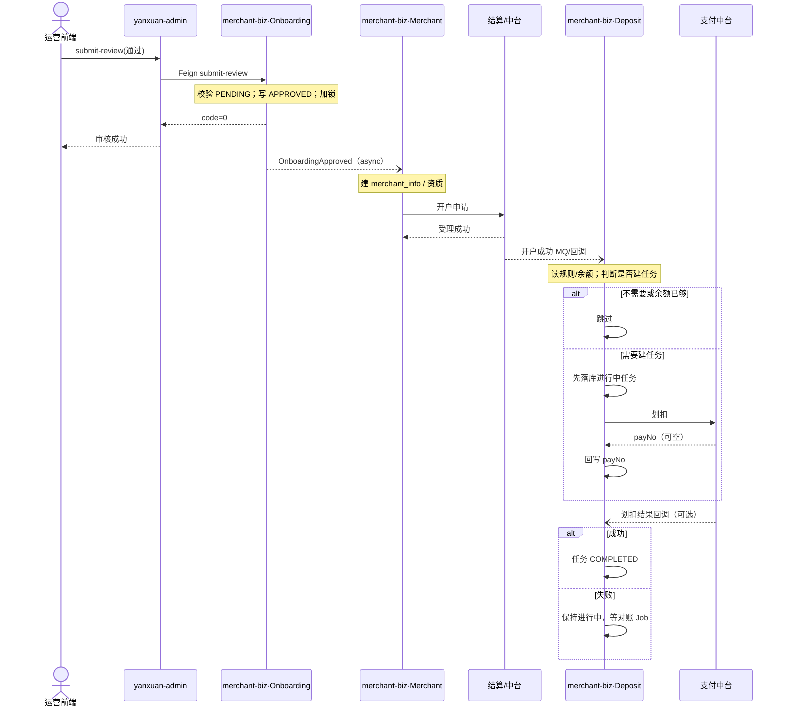
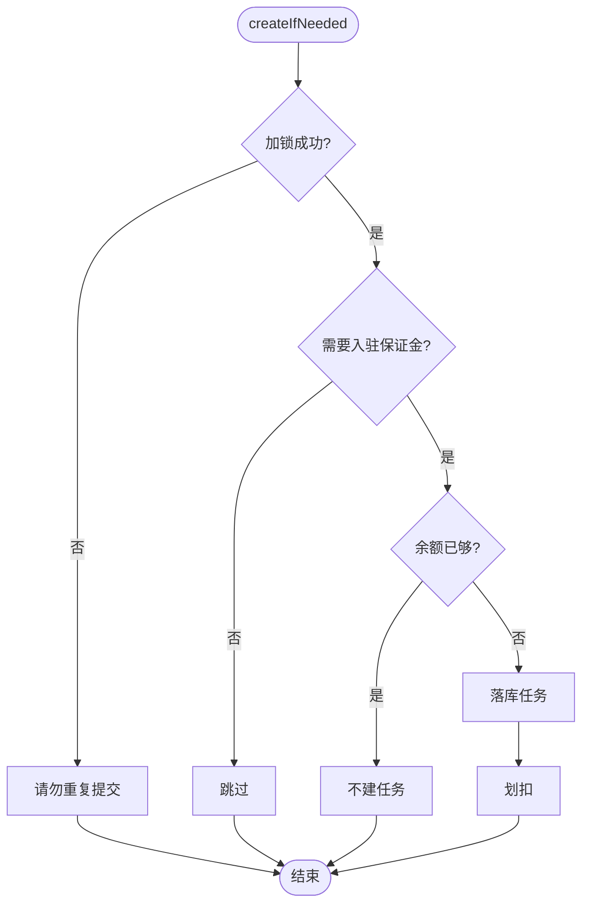

# 链路图画法：简单用文字，复杂用 Mermaid

## 怎么选

| 场景 | 推荐 |
|------|------|
| 链路短、基本单向、分支少 | **纯文字** `text` 树 |
| **多模块来回、事件/MQ/回调多段进场** | **Mermaid `sequenceDiagram`** |
| 单服务内 if-else 特别深 | 可补 `flowchart`，或文字树 |

原则：复杂交互优先 Mermaid，Review 更清楚；简单改动不必强上图语法。

预览：Cursor/VS Code Markdown Preview，或贴到 [mermaid.live](https://mermaid.live)。

---

## 1. 复杂来回：Mermaid 时序图（推荐）

`->>` 同步调用，`--)` 异步（事件/MQ）。`alt/else` 画分支。`Note over` 写服务内步骤。



---

## 2. 简单链路：纯文字即可

```text
[前端] → [BFF] → [biz]
  ├─ 校验；加锁
  ├─ 分支：已存在？→ 0401
  ├─ 调 [风控] ↓ … ↑ 通过/失败
  └─ 写库 → ↑ 成功
```

同一次请求里来回两次，也可以文字：

```text
[BFF]
  └─ ① ↓ [biz] getDetail ↑
  └─ ② ↓ [biz] listLogs ↑
  └─ 拼装 VO → 前端
```

（若再叠异步三段进场，就改用上面的 Mermaid。）

---

## 3. 单服务深分支：flowchart 或文字



---

## 4. 和 easy-spec 的关系

- 模版：`templates/01-tech-design.md`  
- Agent：简单用文字；**复杂多模块来回默认出 Mermaid sequenceDiagram**  
