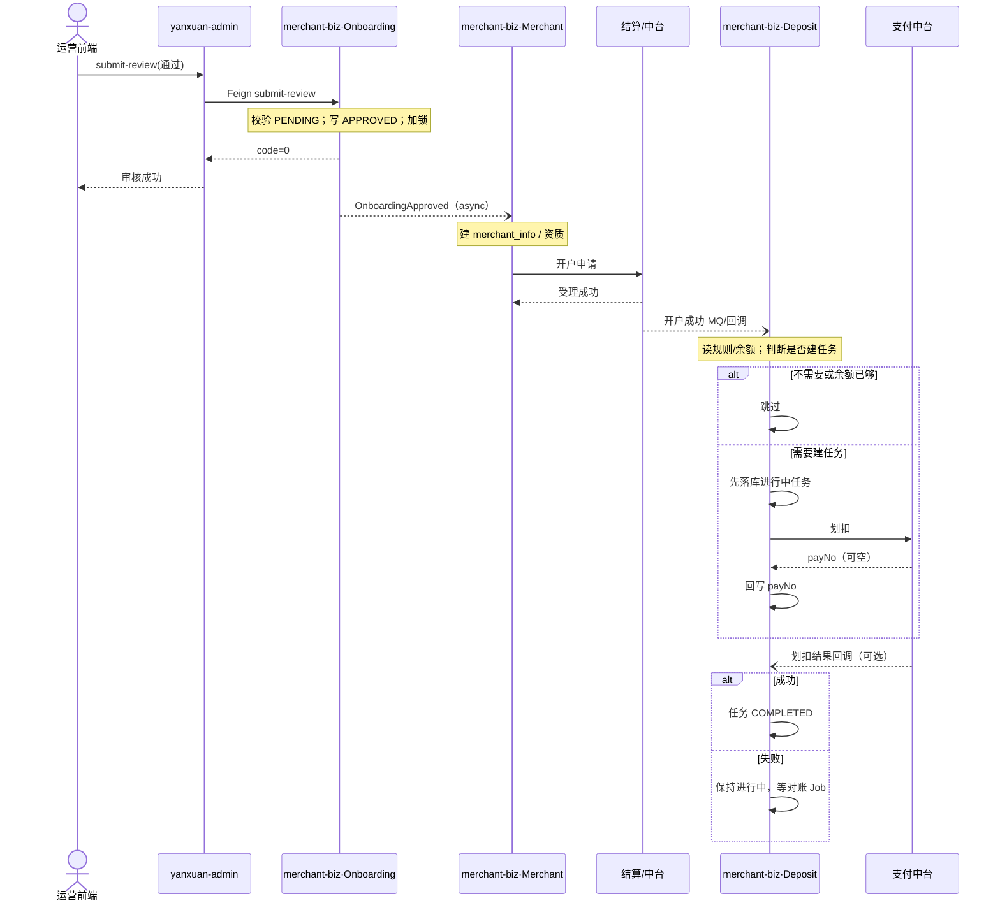

# {{需求名}}技术方案（{{负责人/分工}}）

> 对应需求：{{需求号}} {{需求标题}}
>
> 分工范围：{{本方负责模块/边界一句话}}
>
> 文档状态：草稿 | Review 中 | **已认可**（日期）
>
> 后续文档：同目录 `02-ddl.md`（DDL 文档）、`03-api.md`（前端 API 文档）——方案认可后再出

---

## 〇、输入与边界

### 0.1 输入

| 项 | 说明 |
|----|------|
| PRD / 需求文档 | {{链接或摘要}} |
| 分工 | {{本人}} / {{协作方不做的部分}} |
| 主责仓 / 模块 | {{repo 或 module}} |
| 相关仓 / 服务 | {{BFF / 其它域}} |

### 0.2 In Scope（本期做）

- …

### 0.3 Out of Scope（本期不做）

- …
- 协作方负责：…

### 0.4 关键待拍板（方案阶段）

> 最多列 3～5 个；拍板后写入正文并删除或移到「已决」。

| # | 决策点 | 选项 | 建议 | 状态 |
|---|--------|------|------|------|
| 1 | | | | 待定 |

---

## 一、涉及服务与领域变更总览

### 1.1 涉及服务（必填）

> 本期改动会碰到的 **全部服务**（含只改调用、只消费消息的旁路）。先看清服务面，再看领域包。

| 服务名 | 仓 / 模块 | 本期角色 | 改动概要 |
|--------|-----------|----------|----------|
| `{{如 merchant-admin}}` | `{{repo}}` | BFF 入口 / 主责 / 只读依赖 / 消息消费方 … | {{改了什么，一句话}} |
| `{{如 merchant-biz}}` | | 主责域 | |
| `{{如支付中台}}` | 外系统 | 被调方（本仓不改代码） | 调用哪些能力 |

### 1.2 新增领域 / 模块

| 领域/模块 | 落在哪个服务 | 路径或包 | 核心职责 |
|-----------|--------------|----------|----------|
| | | | |

（可选）计划目录树：

```text
...
```

### 1.3 修改领域 / 模块

| 领域/模块 | 落在哪个服务 | 路径或包 | 改了什么 |
|-----------|--------------|----------|----------|
| | | | |

### 1.4 复用（不改或极少改）

| 能力 | 所在服务 | 说明 |
|------|----------|------|

---

## 二、外部依赖

> 凡本期会**新增或实质用到**的仓外能力都列在这里（含已有依赖的新调用点）。  
> MQ 在此登记「连谁、topic/tag、生产还是消费」；**编排/幂等/失败**见「四、MQ」及各改动点链路。定时 Job 见「五、定时任务」。

### 2.1 外部 SDK / 二方包

| 依赖（GAV 或坐标） | 用途 | 本期动作 | 备注 |
|--------------------|------|----------|------|
| `group:artifact` | OCR / 支付 / … | 新增引入 / 已有加调用 | 版本是否父 POM 管理 |

### 2.2 外部 HTTP / RPC / Feign

| 系统 / 服务 | 调用方式 | 接口或契约 | 同步/异步 | 失败策略 | 备注 |
|-------------|----------|------------|-----------|----------|------|
| 支付中台 / 用户 / … | Feign / HTTP / SDK | `XxxApi#method` 或路径 | 同步 | 重试 / 降级 / 抛错 | |

### 2.3 MQ（生产 / 消费）

| 方向 | Topic / Tag / 队列 | 消息体要点 | 生产者 | 消费者 | 备注 |
|------|-------------------|------------|--------|--------|------|
| 生产 / 消费 | | | 本服务 / 外系统 | 本服务 / 外系统 | 与第×改动点对应 |

### 2.4 其它外部依赖

| 类型 | 说明 |
|------|------|
| OSS / 短信 / 飞书 / 配置中心 / 三方开放平台 … | |

无则写「本期无新增外部依赖」。

---

## 三、具体改动点清单

> 每条改动点必须可执行；标题带类型标签：【新增】【修改】【删除】【复用】。  
> 顺序建议：主流程 → 旁路（事件/Job/通知）→ 配置 → 兼容与迁移。  
> **链路必填且尽量细**：须画出数据经过的 **各个服务**，以及 **每个服务内做了什么**（含判断分支）；细节直接决定后续写码完成度。  
> **文字须完整清晰**；有链路图时 **图与文字分支/步骤/命名必须一致**（改完自检：文字分支数 = 图分支数）。

### 3.x 【类型】{{改动点标题}}

| 维度 | 说明 |
|------|------|
| 类型 | 新增接口 / 修改接口 / 删接口 / 表结构 / 领域逻辑 / 事件 / Job / 配置 / … |
| 触发 | 用户操作 / 审核通过 / 定时 / MQ / … |
| 经过服务 | {{按调用顺序列：前端 → BFF → biz → 中台 …}} |
| API（若有） | `METHOD /path`（标明在哪个服务） |
| 契约/类 | `...` |
| 数据 | 各服务读/写哪些表.字段、缓存 Key |
| 外部依赖 | 引用「二、」中哪些行（SDK / 接口 / MQ） |
| 行为摘要 | 成功/失败、幂等键 |
| 兼容 | 老数据/老前端 |

#### 数据 / 流程链路（必填）

**画图约定：**

| 场景 | 怎么画 |
|------|--------|
| 链路短、单向、分支少 | **纯文字** `text` 树（`[服务]` + `↓`/`↑` + `├─`）即可 |
| **多模块来回、异步多段进场**（事件/MQ/回调） | **优先 Mermaid `sequenceDiagram`**，participant=服务/模块；分支用 `alt`/`else` |
| 单服务内 if-else 特别深 | 可补 `flowchart`，或继续用文字树 |

1. 无论哪种画法，都须写清：**经过哪些服务、每跳做什么、分支与失败收口**。
2. 复杂链路不要只写文字摘要；能画 Mermaid 就画，便于 Review。
3. **图文一致（强制）**：`alt`/`else` 分支标签与上文分支名一致；图中每步动作（写库 / ES / Redis / 终态）不得与文字矛盾或少一支。

**复杂来回示例（Mermaid，推荐）：**



**简单链路示例（纯文字即可）：**

```text
[前端] → [BFF] → [biz]
  ├─ 校验；加锁
  ├─ 分支：已存在？→ 0401
  └─ 写库 → ↑ 成功
```

更多对照见 `examples/mermaid-flowchart-demo.md`。

**读写下沉（复杂改动建议补，按服务拆行）：**

| 步骤 | 服务 | 读 | 写 | 外部调用 |
|------|------|----|----|----------|
| | | | | |

**关键规则 / 伪代码（按需）：**

- …

---

## 四、MQ

> Topic / 生产消费方清单以「二、2.3」为准；本节写 **编排**：谁先谁后、幂等、失败与重试。  
> 进程内 Domain Event / Spring 事件若影响链路，也可列在本表（注明非 MQ）。

| Topic / 事件 | 方向（生产/消费） | 触发条件 | 处理逻辑摘要 | 顺序/幂等 | 失败策略 |
|--------------|-------------------|----------|--------------|-----------|----------|
| | | | | | |

无则写「本期无 MQ / 领域事件编排」。

---

## 五、定时任务

> 本期新增或改造的 Job / 定时扫描。

| Job 名 / Handler | 调度（cron/平台） | 扫描范围 | 处理逻辑摘要 | 幂等 / 失败策略 | 备注 |
|------------------|-------------------|----------|--------------|-----------------|------|
| | | | | | |

无则写「本期无定时任务」。

---

## 六、配置（配置中心 / 开关）

| 配置键 | 默认值 | 含义 |
|--------|--------|------|
| | | |

---

## 七、数据变更意图

> 此处只列变更意图摘要。**完整可执行 DDL** 见同目录 DDL 文档：`02-ddl.md`（方案认可后产出）。

| 对象 | 变更 | 备注 |
|------|------|------|
| | 建表/加列/索引/… | |

---

## 八、对外 HTTP 接口变更摘要

> 此处只列接口面总表，方便方案 Review。**字段说明、请求/响应示例、错误码等完整定义** 见同目录前端 API 文档：`03-api.md`（方案与 DDL 认可后产出）。

| 接口 | 方法 | 路径（BFF 或下游） | 变更 | 一句话用途 |
|------|------|--------------------|------|------------|
| | | | 新增/修改/删除/逻辑变更 | |

---

## 九、已决事项（Review 纪要）

| 日期 | 结论 |
|------|------|
| | |
